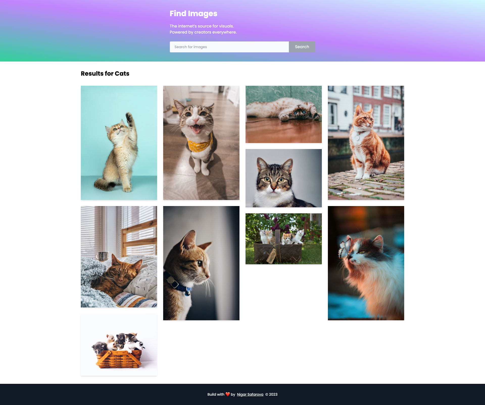

# React Image Gallery with Unsplash API and Tailwind CSS

Image Gallery app is built with the latest technology stack of React, Tailwind CSS, Unsplash API, and Axios.

## Demo Link: 🔗

Preview Live Site ➡️ [here](https://nsafarova.github.io/image-gallery-react-app/)

### Table of contents
* [Features and Technologies](#features-and-technologies)
* [Screenshots](#screenshots)
* [Setup](#setup)

## Features and Technologies

- Dynamic and interactive front-end built with `React`
- Stylish and modern design using `Tailwind CSS`
- High-quality images from `Unsplash API`
- Real-time image fetching with `Axios`
- `Responsive design` for optimal viewing on all devices
- Minimal and user-friendly UI

## Screenshots



## Setup

To run this project, clone the repository and install the dependencies by running the following commands:

```
git clone https://github.com/nsafarova/image-gallery-react-app.git
cd image-gallery
npm install
npm start
```

### Inspiration

This app is ispired from [Unsplash](https://unsplash.com/).
